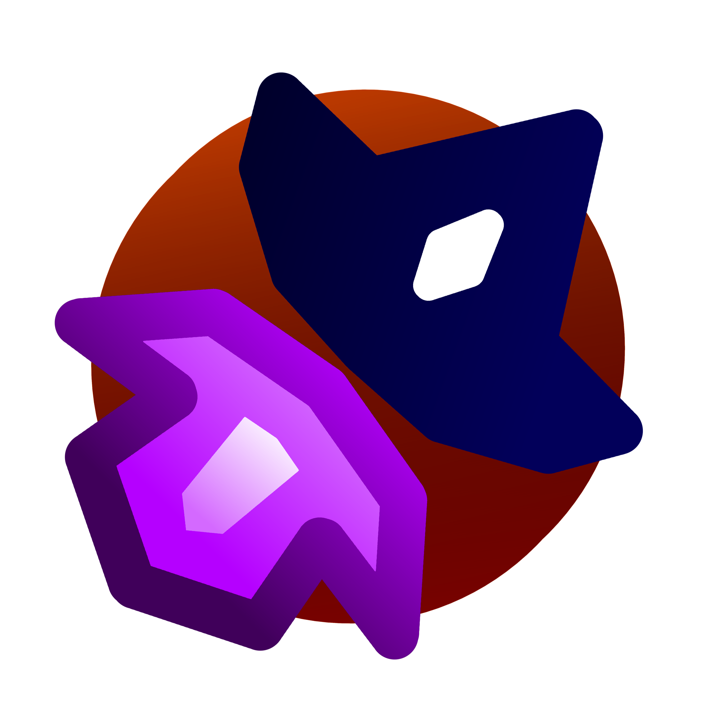

  

<h1 align="center"><strong>Hello world! I'm Marc Albert Seguí Olmos :)</strong></h1>

#### I'm a tinky winky programmer doing some rare programs only for fun and knowledge. Here you can find my projects that have no sense but for me are just fine.
 

---

### Social media:

---

### Programs and things I like to use:

</a>

---

### Programs that I want to learn:

---

<h3>Crepuscular Games</h3>

#### This is one of my little projects that I want to develop on a near future. Will be composed by a solid ideas of videogames that I have in my head but obviously I'm not going to show you what games I'm thinking of XD. What I'm going to show is the concept of diferent demos that I was working on. You will have access to repos soon. 
---

